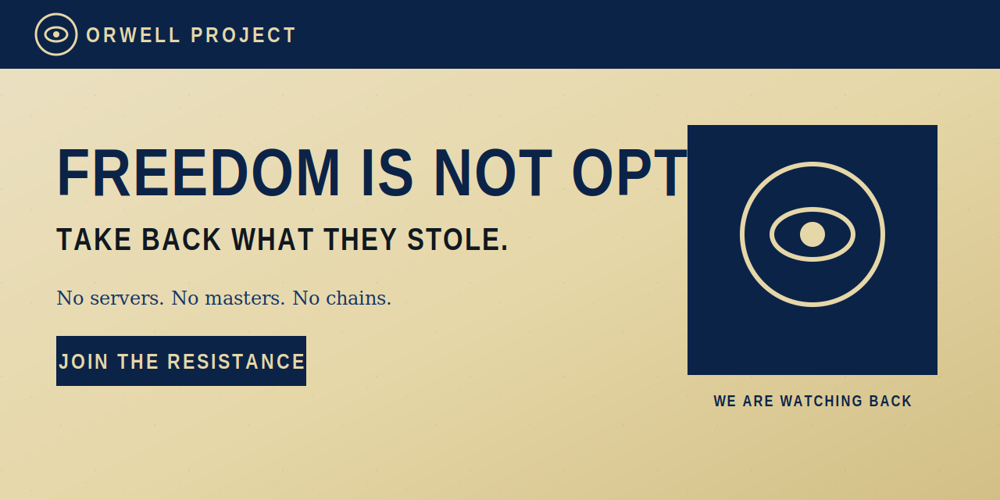

<p align="center">
  
</p>

<p align="center">
  <strong>No servers. No masters. No chains.</strong><br />
  A constellation of decentralized tools to communicate, share and speak without a central choke point.
</p>

<p align="center">
  <a href="#for-everyone">For everyone</a> ·
  <a href="#for-builders">For builders</a> ·
  <a href="#status">Status</a> ·
  <a href="docs/BRAINSTORM.md">Design memory</a> ·
  <a href="mockups/parcours.html">UX mockup</a>
</p>

---

## What is this?

**Orwell Project** is an early-stage design & prototype effort for a privacy-first ecosystem:

| Piece | Role |
|-------|------|
| **Courrier** | Private messaging (dedicated app) |
| **Place publique** | Opinion feed (X-like), without a single narrative owner |
| **Kinothèque** | Video sharing without a takedown desk in the middle |
| **Shared vault** | Local encrypted storage, ephemeral defaults, panic exit |

Think of it as one integrated public square **plus** a serious messenger — not another account farm.

> This repository currently holds **branding, product decisions, and clickable UX mockups**.  
> Protocol and production apps are **not** shipped yet.

---

## For everyone

### The problem we design against

Central platforms and operators are easy to pressure: compel scanning, throttle speech, seize servers, or map *who talks to whom*.  
Encryption of message bodies is not enough if the **address book and metadata** still live in one place.

### What we aim to give you

- **Strong anonymity posture** — harder to prove who said what to whom  
- **No phone number / no email** to exist  
- **Ephemeral messages** by default  
- **Dead man’s switch** — voluntary local wipe under duress  
- Tools you can use without booting a specialist OS for every chat  

### What we do *not* promise

- A network that can never be disrupted  
- Magic protection if your device is fully compromised  
- Protection against screenshots or a malicious contact  

Honest slogan: **we shrink the loot, we don’t vaporize reality.**

### Try the UX mockup

Open locally in a browser:

```text
mockups/parcours.html
```

Walkthrough: create an identity → one-shot pass → blind mailboxes → chat → ephemeral purge → Dead man’s switch → public square teaser.

Landing exploration: `index.html`

---

## For builders

### Design priorities (locked for now)

1. **Metadata / anonymity over “uncensorable at all costs”**
2. **Delivery model B** — blind store-and-forward queues (not must-be-online P2P)
3. **Tor** as primary transport to relays
4. **Audited crypto primitives** (e.g. Double Ratchet / Noise family) — **no home-made ciphers**
5. **Invitation-only** private lines from the public square (v1)

### Conceptual stack

```text
Identity (local keys)
    → Obfuscated transport (Tor)
    → E2E payloads on blind queues
    → Optional heavy content layer (IPFS-like later)
```

| Layer | Direction |
|-------|-----------|
| Tor | Pipe |
| Blind queues | Who-talks-to-whom minimization |
| IPFS-like | Media / manifests (not default anonymity) |
| Chain | Optional spam/anchor later — **not** for realtime chat |

Full decision log: [`docs/BRAINSTORM.md`](docs/BRAINSTORM.md)

### Repo map

```text
.
├── index.html                 # Landing mock
├── styles.css
├── mockups/                   # Clickable user-journey prototype
├── docs/
│   ├── BRAINSTORM.md          # Product / threat-model memory
│   ├── REPO_META.md           # GitHub description & topics
│   └── github-assets/         # Banner, logo, infographics (see specs)
└── README.md
```

### Visual assets

Drop final PNGs in [`docs/github-assets/`](docs/github-assets/).  
Dimensions and brief: [`docs/github-assets/README.md`](docs/github-assets/README.md).

SVG placeholders ship today (`banner-readme.svg`, `logo-mark.svg`) so the README renders before the print-ready art is uploaded.

---

## Status

| Area | State |
|------|--------|
| Brand direction | In progress (hero / mockup) |
| UX journey mockup | Clickable prototype |
| Protocol / crypto implementation | Not started |
| Relays / apps | Not started |
| License | TBD — see [`docs/REPO_META.md`](docs/REPO_META.md) |

---

## Contributing (for now)

We’re in **design memory** mode:

- Critique the threat model and UX in issues  
- Propose copy / accessibility / OPSEC wording  
- Do **not** expect a production protocol RFC yet  

Please don’t submit “custom encryption algorithms.” Composition of proven primitives is welcome; novelty ciphers are not.

---

## License

**TBD.** Until a file is added, treat the code and mocks as source-available for review only.  
Candidates: GPL-3.0, AGPL-3.0, or Apache-2.0 — maintainer decides before a real release.

---

<p align="center">
  
</p>

<p align="center"><em>Big Brother is watching. We are watching back.</em></p>
